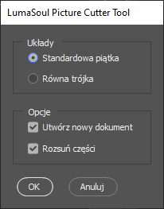

# lumasoul-tools

## PictureCutter

[Link do skryptu](./scripts/PictureCutter.jsx)

Narzędzie do cięcia obrazów na wcześniej zdefiniowane części (układy).

Plik skryptu z linka powyżej ściągnąć i zapisać na komputer z Photoshopem.

Uruchamianie skryptu:

Widok okna skryptu:

